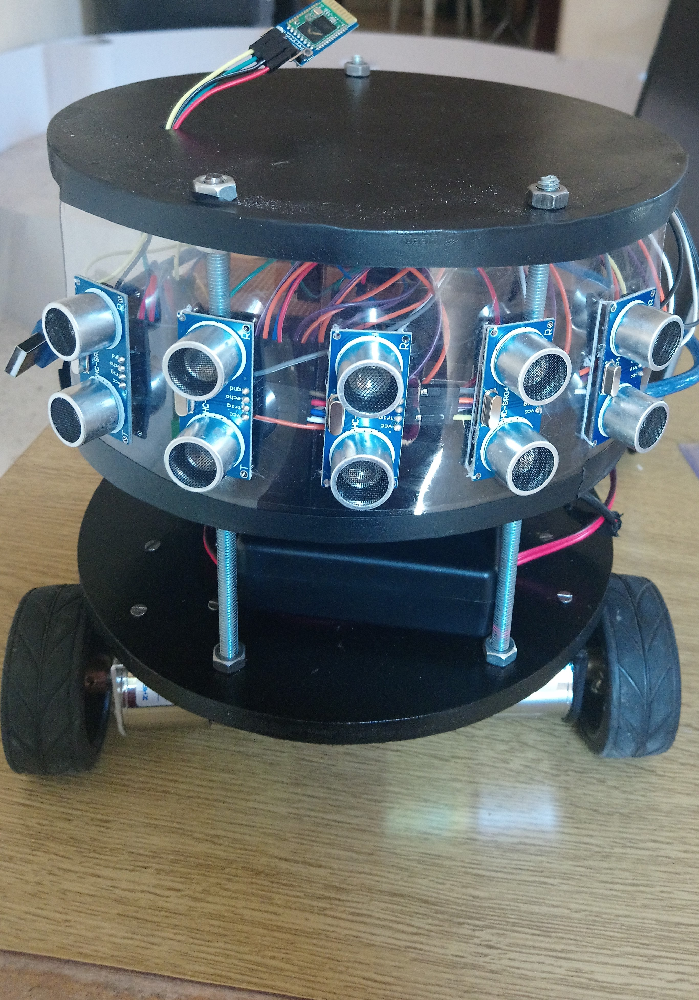

# A-Mobile-Robot using Graph Theories and Q-learning Algorithm

  

<h3>Abstract:</h3>

The robot has been tested using two ways, by a maze where we should determine the starting and ending points. Through using a specific search algorithm to find the shortest path, the robot can access to the final destination and bypass static obstacles without any human intervention; Or through the free motion that relies on using machine learning to make the robot avoiding the fixed or mobile obstacles.
This report presents the algorithms and tools that we used for building the robot. Moreover, it shows experiments that we have done to reach satisfactory results.

In this project, we designed the robot using 3D windows builder. You can find all the designs in the Project Designs Folder.

<h3>Discerption for Robot’s work:</h3>

First Practical procedure, we did was moving the robot from point A to point B using Graphs to execute a programming map making the robot apply to surpass the obstacles that are already defended. Also, the obstacles that it may face during his movement to reach his final destination on this map.

The Second Practical Procedure, we made the robot apply to learn and study the environment surrounding him using Reinforcement Learning Algorithm called Q-learning.
We used Python as the main programing language for writing the Algorithms (Graphs – Q-learning).

For the hardware part, Arduino Mega has been used with 1 Bluetooth receiver shield (HC-05), 5 Distance Sensor Ultrasonic sensor (Hc-sr04), 1 motors controller shield(Module l298n H Bridge) and 2 Dc-motors.

The Arduino receive the data that he needs from python and acts based on specific Arduino C code wrote to control all the shield connected to it.

<h3>Videos:</h3>

These videos demonstrate and show how the robot work with a real life practices:

<ul>
  <li><a href="https://drive.google.com/file/d/1p0-A6AlrSEub70bN8qfpGQH4ofiVB75C/view?usp=sharing">Graph</a></li>
  <li><a href="https://drive.google.com/file/d/1G2AMHnhWlAq66gghG7Q5SwaaNtn352eC/view?usp=sharing">Q-Learning</a></li>
  </ul>
  
<h3>References:</h3>
<ul>
  <li>https://ocw.mit.edu/courses/electrical-engineering-and-computer-science/6-0001-introduction-to-computer-science-and-programming-in-python-fall-2016/</li>
  <li>https://ocw.mit.edu/courses/electrical-engineering-and-computer-science/6-0002-introduction-to-computational-thinking-and-data-science-fall-2016/</li>
  <li>http://ai.berkeley.edu/course_schedule.html</li>
  <li>CJCH Watkins, P Dayan, “Q-learning” Machine learning Journal, Vol 8, p 279-292</li>
  <li>Sebastian Raschka & Vahid Mirjalili (2017) “python machine learning”, second edition, pp. 610-622</li>
</ul>
<h3>Thesis:</h3>

You can find the full Bachelor thesis in Arabic: <a href="https://drive.google.com/file/d/1EF5tafwYIltcWr5bGRT1gw_Mej2G0-bD/view?usp=sharing">Here</a>

